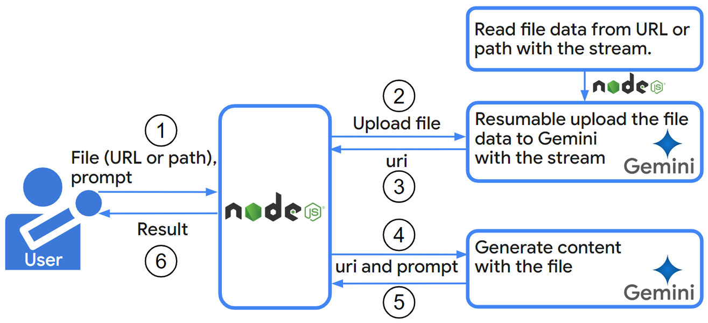

# resumableUploadForGoogleAPIs_nodejs

<a name="top"></a>
[](LICENCE)

## Overview

This is a script for achieving the resumable upload through the stream using Google APIs with Node.js.

## Description

The `@google/generative-ai` library provides a powerful way to interact with the Gemini Generative AI API using Node.js. This enables developers to programmatically generate creative text formats, translate languages, write different kinds of creative content, and answer your questions in an informative way, all powered by Gemini's advanced AI models. [Ref](https://github.com/google-gemini/generative-ai-js)

However, the current implementation within `@google/generative-ai` for uploading file data to Gemini seems limited to local files using the `multipart` method. [Ref](https://github.com/google-gemini/generative-ai-js/blob/b1e69923ca89511f485616f10ffa539674a4f6d9/packages/main/src/server/file-manager.ts#L53) This poses a challenge in scenarios where you might need to:

- **Utilize file data directly from a website**: Downloading the file first and then uploading it to Gemini can be an unnecessary and time-consuming step.
- **Handle large files**: Reading large files using `readFileSync` can be memory-intensive and potentially lead to errors on machines with limited resources.

This report introduces a script that addresses these limitations by employing **resumable upload with file streams**. This script allows uploading files to Gemini from both local storage and web URLs, regardless of size. Here are the key benefits:

- **Flexibility**: Upload files directly from a website URL, eliminating the need for manual download and upload steps.
- **Scalability**: Handle large files efficiently by reading the data in chunks using streams, mitigating memory constraints.
- **Reusability**: The script can be adapted for use with other Google APIs like Drive API and YouTube API that also support resumable uploads.

This improved approach offers a more versatile and efficient solution for working with file-based content within the Gemini Generative AI API using Node.js.

## Process

The process of this script is as follows.



## Usage

### Main script

The main script for achieving the resumable upload with the steam is as follows. Please save this script as `resumableUploadForGoogleAPIs.js`.

```javascript
/**
 * ### Description
 * Function for achieving the resumable upload with Google APIs.
 * You can achieve the resumable upload with various Google APIs by changing resumableUrl.
 *
 * @param {object} object - Object for running this function.
 * @param {string} object.filePath - File path of the file for uploading.
 * @param {string} object.fileUrl - File URL of the file for uploading.
 * @param {string} object.resumableUrl - URL for running the resumable upload.
 * @param {number} object.dataSize - Data size (content size, file size) of the file.
 * @param {string} object.accessToken - Access token for uploading with Google API you want to use.
 * @param {string} [object.metadata={}] - Metadata for Google API.
 * @param {number} [object.chunkSize=16777216] - The default chunk size is 16 MB (16,777,216 bytes). This is used as the chunk size for the resumable upload. This is 10 MB as a sample. In this case, please set the multiples of 256 KB (256 x 1024 bytes)
 *
 * @return {object}
 */
function resumableUpload(object) {
  const fs = require("fs");
  const stream = require("stream");

  const {
    filePath = "",
    fileUrl = "",
    resumableUrl = "",
    dataSize = 0,
    accessToken,
    metadata = {},
    chunkSize = 16777216,
  } = object;
  return new Promise(async (resolve, reject) => {
    let mainData;
    if (resumableUrl == "" || dataSize == 0) {
      throw new Error("Please set resumableUrl and dataSize");
    }

    // Retrieve data from file or url as steam.
    if (filePath != "" && fileUrl == "") {
      mainData = fs.createReadStream(filePath);
    } else if (filePath == "" && fileUrl != "") {
      const res1 = await fetch(fileUrl);
      mainData = new stream.Readable.fromWeb(res1.body);
    } else {
      throw new Error("Please set filePath or fileUrl");
    }
    const streamTrans = new stream.Transform({
      transform: function (chunk, _, callback) {
        callback(null, chunk);
      },
    });
    mainData.pipe(streamTrans);

    // Retrieve session for resumable upload.
    const headers = { "Content-Type": "application/json" };
    if (accessToken) {
      headers.authorization = `Bearer ${accessToken}`;
    }
    const res2 = await fetch(resumableUrl, {
      method: "POST",
      headers,
      body: JSON.stringify(metadata),
    });
    let location = "";
    if (res2.ok) {
      location = res2.headers.get("location");
      console.log("The location URL could be obtained.");
    } else {
      reject({ status: res2.status, error: await res2.json() });
      return;
    }

    // Upload the file.
    let startByte = 0;
    let bufferData = [];
    streamTrans.on("data", async (chunk) => {
      bufferData.push(chunk);
      const temp = Buffer.concat(bufferData);
      if (temp.length >= chunkSize) {
        const dataChunk = temp.slice(0, chunkSize);
        const left = temp.slice(chunkSize);
        streamTrans.pause();
        let upCount = 0;

        const upload = async () => {
          console.log(
            `Progress: from ${startByte} to ${
              startByte + dataChunk.length - 1
            } for ${dataSize}`
          );
          const res3 = await fetch(location, {
            method: "PUT",
            headers: {
              "Content-Range": `bytes ${startByte}-${
                startByte + dataChunk.length - 1
              }/${dataSize}`,
            },
            body: dataChunk,
          });
          const text = await res3.text();
          // console.log({ ok: res3.ok, status: res3.status, body: text }); // For debug
          if (res3.ok && res3.status == 200) {
            try {
              resolve(JSON.parse(text));
            } catch (_) {
              resolve(text);
            }
            return;
          } else {
            if (res3.status == 308) {
              startByte += dataChunk.length;
              streamTrans.resume();
              return;
            }
            if (upCount == 3) {
              reject({ status: res3.status, error: text });
              return;
            }
            upCount++;
            console.log(`Retry: ${upCount} / 3`);
            console.log(text);
            await upload();
            return;
          }
        };

        await upload();
        bufferData = [left];
      }
    });
    streamTrans.on("end", async () => {
      const dataChunk = Buffer.concat(bufferData);
      if (dataChunk.length > 0) {
        // Upload last chunk.
        let upCount = 0;

        const upload = async function () {
          console.log(
            `Progress(last): from ${startByte} to ${
              startByte + dataChunk.length - 1
            } for ${dataSize}`
          );
          const res4 = await fetch(location, {
            method: "PUT",
            headers: {
              "Content-Range": `bytes ${startByte}-${
                startByte + dataChunk.length - 1
              }/${dataSize}`,
            },
            body: dataChunk,
          });
          const text = await res4.text();
          // console.log({ ok: res4.ok, status: res4.status, body: text }); // For debug
          if (res4.ok && res4.status == 200) {
            try {
              resolve(JSON.parse(text));
            } catch (_) {
              resolve(text);
            }
            return;
          } else {
            if (res4.status == 308) {
              startByte += dataChunk.length;
              streamTrans.resume();
              return;
            }
            if (upCount == 3) {
              reject({ status: res4.status, error: text });
              return;
            }
            upCount++;
            console.log(`Retry: ${upCount} / 3`);
            await upload();
            return;
          }
        };

        await upload();
      }
    });
    streamTrans.on("error", (err) => reject(err));
  });
}

module.exports = { resumableUpload };
```

### Sample scripts

#### Gemini API

This is a sample script for generating content by uploading a video file to Gemini with the resumable upload. Please set your API key, `fileUrl` or `filePath` and `dataSize`.

By you set the video file to `fileUrl` or `filePath`, when this script is run, content is generated by a prompt `Tell me about this video.`.

Please save this script as `sample1.js` to the same directory of the file `resumableUploadForGoogleAPIs.js`.

If `@google/generative-ai` is not installed, please install it by `npm install @google/generative-ai`.

```javascript
const { resumableUpload } = require("./resumableUploadForGoogleAPIs");

async function sample_geminiAPI() {
  const { GoogleGenerativeAI } = require("@google/generative-ai");
  const { GoogleAIFileManager, FileState } = require("@google/generative-ai/server");

  const apiKey = "###"; // Please set your API key.

  const object = {
    // Set direct link of the file.
    fileUrl: "###",

    // If you want to use the file path of the local PC, please use filePath
    // filePath: "###",

    // Set URL for uploading with the resumable upload.
    resumableUrl: `https://generativelanguage.googleapis.com/upload/v1beta/files?uploadType=resumable&key=${apiKey}`,

    // Set data size (file size).
    dataSize: ###, // Please set the file size.

    // If you want to use your access token, please use this.
    // accessToken: "###",

    // Set metadata.
    metadata: { file: { displayName: "sampleVideo1", mimeType: "video/mp4" } },
  };
  const uploadResult = await resumableUpload(object).catch((err) =>
    console.log(err)
  );

  // The below script is from https://ai.google.dev/api/files#video
  const fileManager = new GoogleAIFileManager(apiKey);
  let file = await fileManager.getFile(uploadResult.file.name);
  while (file.state === FileState.PROCESSING) {
    process.stdout.write(".");
    // Sleep for 10 seconds
    await new Promise((resolve) => setTimeout(resolve, 10_000));
    // Fetch the file from the API again
    file = await fileManager.getFile(uploadResult.file.name);
  }

  if (file.state === FileState.FAILED) {
    throw new Error("Video processing failed.");
  }

  // View the response.
  console.log(
    `Uploaded file ${uploadResult.file.displayName} as: ${uploadResult.file.uri}`
  );

  const genAI = new GoogleGenerativeAI(apiKey);
  const model = genAI.getGenerativeModel({ model: "gemini-1.5-flash-latest" });
  const result = await model.generateContent([
    "Tell me about this video.",
    {
      fileData: {
        fileUri: uploadResult.file.uri,
        mimeType: uploadResult.file.mimeType,
      },
    },
  ]);
  console.log(result.response.text());
}

sample_geminiAPI();
```

#### Drive API

This is a sample script for generating content by uploading a file to Google Drive with the resumable upload. Please set your access token, `fileUrl` or `filePath` and `dataSize`, and `mimeType` of `metadata`.

By you set the video file to `fileUrl` or `filePath`, when this script is run, the file is uploaded to the root folder. If the access token from the service account is used, the file is the root folder of the Drive of the service account.

Of course, you can modify `metadata` to your actual situation.

Please save this script as `sample2.js` to the same directory of the file `resumableUploadForGoogleAPIs.js`.

```javascript
const { resumableUpload } = require("./resumableUploadForGoogleAPIs");

function sample_driveAPI() {
  const object = {
    // Set direct link of the file.
    fileUrl: "###",

    // If you want to use the file path of the local PC, please use filePath
    // filePath: "###",

    // Set data size (file size).
    dataSize: ###, // Please set the file size.

    // Set URL for uploading with the resumable upload.
    resumableUrl: "https://www.googleapis.com/upload/drive/v3/files?uploadType=resumable",

    // Set your access token.
    accessToken: "###",

    // Set metadata.
    metadata: { name: "sample filename", mimeType: "your mimeType" },
  };
  resumableUpload(object)
    .then((res) => console.log(res))
    .catch((err) => console.log(err));
}

sample_driveAPI();
```

In this case, Drive API is required to be enabled and the access token for uploading the file to Google Drive is required to be used.

If you want to upload the file to the shared drive, please add `supportsAllDrives=true` to the query parameter of `resumableUrl` like `https://www.googleapis.com/upload/drive/v3/files?uploadType=resumable&supportsAllDrives=true"`.

#### YouTube API

This is a sample script for generating content by uploading a file to YouTube with the resumable upload. Please set your access token, `fileUrl` or `filePath` and `dataSize`.

By you set the video file to `fileUrl` or `filePath`, when this script is run, the file is uploaded to the root folder.

Of course, you can modify `metadata` to your actual situation.

Please save this script as `sample3.js` to the same directory of the file `resumableUploadForGoogleAPIs.js`.

```javascript
const { resumableUpload } = require("./resumableUploadForGoogleAPIs");

function sample_youtubeAPI() {
  const object = {
    // Set direct link of the file.
    fileUrl: "###",

    // If you want to use the file path of the local PC, please use filePath
    // filePath: "###",

    // Set data size (file size).
    dataSize: ###, // Please set the file size.

    // Set URL for uploading with the resumable upload.
    resumableUrl: "https://www.googleapis.com/upload/youtube/v3/videos?uploadType=resumable&part=snippet,status",

    // Set your access token.
    accessToken: "###",

    // Set metadata.
    metadata: {
      snippet: {
        description: "Upload sample.",
        title: "Sample uploaded video.",
      },
      status: { privacyStatus: "private" },
    }
  };
  resumableUpload(object)
    .then((res) => console.log(res))
    .catch((err) => console.log(err));
}

sample_youtubeAPI();
```

In this case, YouTube Data API is required to be enabled and the access token for uploading the file to YouTube is required to be used.

---

<a name="licence"></a>

# Licence

[MIT](LICENCE)

<a name="author"></a>

# Author

[Tanaike](https://tanaikech.github.io/about/)

[Donate](https://tanaikech.github.io/donate/)

<a name="updatehistory"></a>

# Update History

- v1.0.0 (August 24, 2024)

  1. Initial release.

[TOP](#top)
